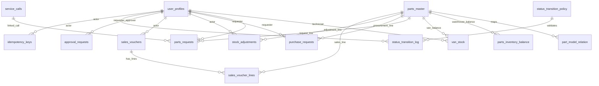

# Phase 2 Handover

## Scope Delivered
Phase 2 (Data & Security Foundation) completed with:
- schema migrations for core entities and control tables
- status enums and legal transition enforcement
- idempotency infrastructure
- immutable audit infrastructure
- baseline RLS policies with region scope + manager override model

## Migration Set and Rationale

### Applied migrations
1. `supabase/migrations/20260610225000_phase2_foundation.sql`
   - creates schema, enums, core tables, control tables
   - creates status policy table and seeds legal transitions
   - adds constraints/indexes/triggers
   - enables RLS and creates baseline policies
   - adds idempotent mutation function: `app.update_parts_request_status(...)`
2. `supabase/migrations/20260610225100_phase2_rollback.sql`
   - intentionally retained as no-op placeholder to preserve migration history alignment
3. `supabase/migrations/20260610230000_phase2_foundation_reapply.sql`
   - reapply forward migration after prior rollback execution in remote history
4. `supabase/migrations/20260610231500_phase2_fix_idempotency_fingerprint.sql`
   - patches fingerprinting implementation in `app.update_parts_request_status`
   - switches from `digest(...)` to `md5(...)` for environment compatibility

### Why these decisions
- **Status enforcement in DB layer**: protects legal workflow regardless of client behavior.
- **Idempotency in DB**: prevents double-posting under retries/concurrency.
- **Trigger-based audit**: ensures every status mutation is logged with before/after.
- **RLS region scope + override**: aligns with approved policy (`region_scope` + manager-approval override trail).
- **No hard delete triggers**: enforces immutable operational history.

## ERD (Phase 2)

## Status Transition Matrix

### `parts_requests`
- `requested -> pending | cancelled`
- `pending -> reserved | partially_reserved | out_of_stock | cancelled`
- `reserved -> ready_for_pickup | partially_ready | cancelled`
- `partially_reserved -> partially_ready | back_ordered | cancelled`
- `ready_for_pickup -> received | transfer_pending | cancelled`
- `partially_ready -> partially_received | back_ordered | cancelled`
- `received -> consumed | to_return | transfer_pending`
- `partially_received -> consumed | to_return | back_ordered`
- `to_return -> returned | discrepancy`
- `out_of_stock -> back_ordered | cancelled`
- `back_ordered -> reserved | partially_reserved | ready_for_pickup | cancelled`
- `transfer_pending -> transfer_handed_over | transfer_cancelled | transfer_expired`
- `transfer_handed_over -> transfer_received | transfer_discrepancy | transfer_expired`
- `transfer_received -> consumed | to_return`
- `transfer_discrepancy -> transfer_cancelled`

### `purchase_requests`
- `created -> ordered | cancelled`
- `ordered -> partially_received | received | cancelled`
- `partially_received -> received | closed | cancelled`
- `received -> closed`

### `sales_vouchers`
- `draft -> issued | cancelled`
- `issued -> paid | cancelled`
- `paid -> refunded`

## RLS Matrix (Baseline)

Model: region-scoped access by `region_code`.
Override: `service_manager` cross-region access only with approved record in `app.approval_requests` (`override_scope='cross_region_access'`, reason required).

| Domain | technician | warehouse_controller | dispatcher | service_manager | finance_admin |
|---|---|---|---|---|---|
| `parts_master`, `part_model_relation` | read | read | read | read (+ override path) | read |
| `parts_inventory_balance`, `van_stock` | read (tech constrained to own van rows) | read | read | read (+ override path) | read |
| `parts_requests`, `purchase_requests`, `stock_adjustments`, `service_calls` | read | read | read | read (+ override path) | read |
| `sales_vouchers`, `sales_voucher_lines`, `daily_cash_register` | no by default | read | no by default | read | read |
| `status_transition_log` | region-scoped read via joined entity | region-scoped read | region-scoped read | region + override | finance-relevant via region policies |
| `approval_requests` | region read; requester insert | region read; requester insert | region read; requester insert | region read/update; approver path | region read; requester insert |
| `idempotency_keys` | self row only | self row only | self row only | self row only | self row only |
| `notification_queue` | recipient-based read | recipient-based read | recipient-based read | recipient-based read | recipient-based read |

## Operational Invariants Enforced
- `stock_available = stock_on_hand - stock_reserved` generated column.
- `stock_on_hand >= stock_reserved` check.
- no hard delete on operational/control tables (trigger-enforced).
- `status_transition_log` immutable (update/delete blocked).
- mutation RPC requires `idempotency_key`.
- illegal status transitions rejected at DB layer.

## Known Limitations Before Phase 3
- only baseline mutation RPC (`update_parts_request_status`) exists.
- no procurement/return/discrepancy-specific RPCs yet.
- notification queue is schema-ready; dispatch workers are not yet implemented.
