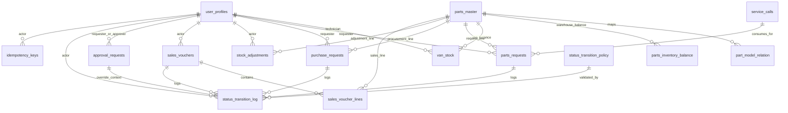

# Phase 2 Preflight (Approved)

Approval captured with selected options:
- Preflight approval: approved
- Branch visibility: `region_scope`
- Manager override: required reason + approval trail
- Optional role: `finance_admin` enabled

## 1) ERD (Phase-2 Tables)

## 2) Centralized Status Enums + Legal Transition Matrix

### `parts_request_status`
- `requested`
- `pending`
- `reserved`
- `partially_reserved`
- `ready_for_pickup`
- `partially_ready`
- `received`
- `partially_received`
- `to_return`
- `returned`
- `consumed`
- `out_of_stock`
- `back_ordered`
- `cancelled`
- `discrepancy`
- `transfer_pending`
- `transfer_handed_over`
- `transfer_received`
- `transfer_discrepancy`
- `transfer_cancelled`
- `transfer_expired`

### `purchase_request_status`
- `created`, `ordered`, `partially_received`, `received`, `closed`, `cancelled`

### `sales_voucher_status`
- `draft`, `issued`, `paid`, `cancelled`, `refunded`

### Legal transitions (stored in `status_transition_policy`)
- Workflow `parts_requests`:
  - `requested -> pending | cancelled`
  - `pending -> reserved | partially_reserved | out_of_stock | cancelled`
  - `reserved -> ready_for_pickup | partially_ready | cancelled`
  - `partially_reserved -> partially_ready | back_ordered | cancelled`
  - `ready_for_pickup -> received | transfer_pending | cancelled`
  - `partially_ready -> partially_received | back_ordered | cancelled`
  - `received -> consumed | to_return | transfer_pending`
  - `partially_received -> consumed | to_return | back_ordered`
  - `to_return -> returned | discrepancy`
  - `out_of_stock -> back_ordered | cancelled`
  - `back_ordered -> reserved | partially_reserved | ready_for_pickup | cancelled`
  - `transfer_pending -> transfer_handed_over | transfer_cancelled | transfer_expired`
  - `transfer_handed_over -> transfer_received | transfer_discrepancy | transfer_expired`
  - `transfer_received -> consumed | to_return`
  - `transfer_discrepancy -> transfer_cancelled`
- Workflow `purchase_requests`:
  - `created -> ordered | cancelled`
  - `ordered -> partially_received | received | cancelled`
  - `partially_received -> received | closed | cancelled`
  - `received -> closed`
- Workflow `sales_vouchers`:
  - `draft -> issued | cancelled`
  - `issued -> paid | cancelled`
  - `paid -> refunded`

## 3) RLS Policy Matrix (Baseline)

Baseline mode: `region_scope`
- Access check = same `region_code`, OR approved manager override for cross-region.
- Override required: `approval_requests` row with:
  - `override_scope = cross_region_access`
  - `approval_status = approved`
  - non-empty `reason_code` + `reason_comment`
  - requester is the acting manager.

| Table group | technician | warehouse_controller | dispatcher | service_manager | finance_admin |
|---|---|---|---|---|---|
| Reference (`parts_master`, `part_model_relation`) | read region | read/write region via RPC later | read region | read region + approved override | read region |
| Inventory (`parts_inventory_balance`, `van_stock`) | read own/region | read region | read region | read region + approved override | read region |
| Operational (`parts_requests`, `purchase_requests`, `stock_adjustments`, `sales_vouchers`, `sales_voucher_lines`, `daily_cash_register`, `service_calls`) | read region | read region | read region | read region + approved override | read limited to sales/cash region |
| Control (`approval_requests`) | none | request only | request only | request + approve per policy | request only |
| Control (`idempotency_keys`, `status_transition_log`, `notification_queue`) | read own audit/idempotency | read region audit | read region audit | read region + approved override | read finance-relevant rows |

Notes:
- Direct DML to inventory/cash tables is revoked from `authenticated`.
- Mutations are intended through RPC/functions with authorization re-checks.

## 4) Idempotency Design

Table: `idempotency_keys`
- Key shape: unique `(actor_id, action_name, idempotency_key)`.
- Required request fingerprint: deterministic hash/string from request payload.
- Conflict behavior:
  - same key + same fingerprint + succeeded => return stored response (replay-safe).
  - same key + different fingerprint => reject (conflict).
  - same key + processing => reject as in-progress.
  - failed entries kept for audit/retry analysis.

## 5) Audit Schema & Immutable Strategy

Table: `status_transition_log`
- Required fields:
  - `table_name`, `record_id`
  - `from_status`, `to_status`
  - `actor_id`, `actor_role`, `created_at`
  - `idempotency_key`
  - `reason_code`, `reason_comment`
  - `metadata` JSONB
- Immutable strategy:
  - INSERT-only model.
  - `BEFORE UPDATE OR DELETE` trigger raises exception.
- Additional compliance:
  - Operational tables protected by `prevent_hard_delete` trigger.
  - Status changes logged automatically by transition triggers/RPC.
